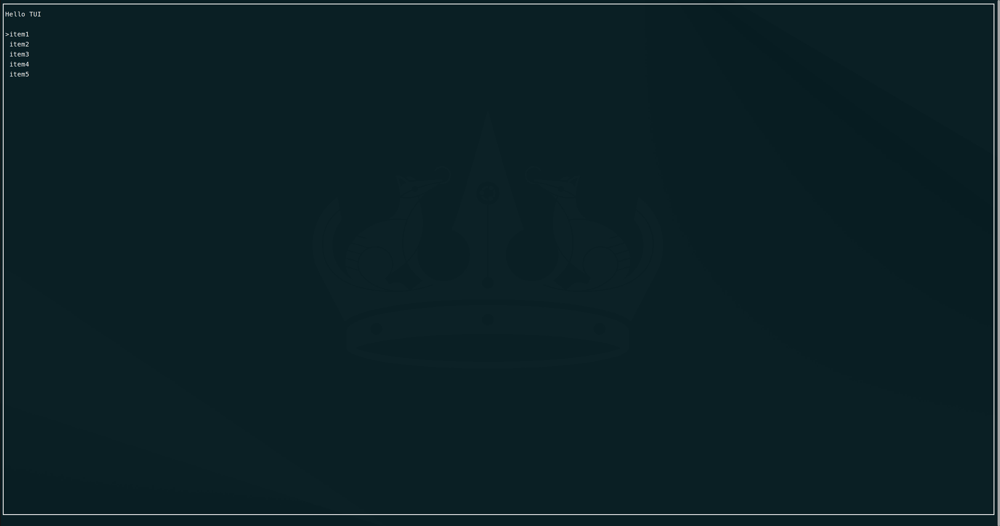

# Examples

Here are some examples of how to use the TUI library in C++.

```cpp
#include "terminal.h"

using namespace terminal;
int main() {
  app.init();
  Text text;
  text.set_text("Hello TUI!");

  List list;
  list.set_items({"item1", "item2", "item3", "item4", "item5", "item1", "item2",
                  "item3", "item4", "item5"});

  Block box;
  text.set_pos({1, 1, 20, 1});
  list.set_pos({1, 3, 20, 5});
  box.set_pos({0, 0, FULL, FULL});
  app.loop([&]() {
    box.draw();
    text.draw();
    list.draw();

    input::key.read();
    auto key = input::key.getKeyCode();

    if (key == input::KeyCode::UP) {
      list.move_up();
    }
    if (key == input::KeyCode::DOWN) {
      list.move_down();
    }
    if (key == input::KeyCode::CHAR) {
      char c = input::key.getCurrentChar();
      if (c == 'q') {
        app.stop();
      } else {
        text.push(c);
      }
    }
  });

  return 0;
}
```

And this is minimal `CMakeLists.txt` to build the example:

```cmake
cmake_minimum_required(VERSION 3.16)
project(app LANGUAGES CXX)

add_subdirectory(lib/Terminal-Library)

add_executable(app src/main.cpp)
target_link_libraries(app PRIVATE terminal)
```




### KeyBindings
- `UP`: Move up in the list
- `DOWN`: Move down in the list
- `q`: Quit the application
- Any other character will be appended to the text "Hello TUI!"


author: K10-K10
update: 12/04/2026
